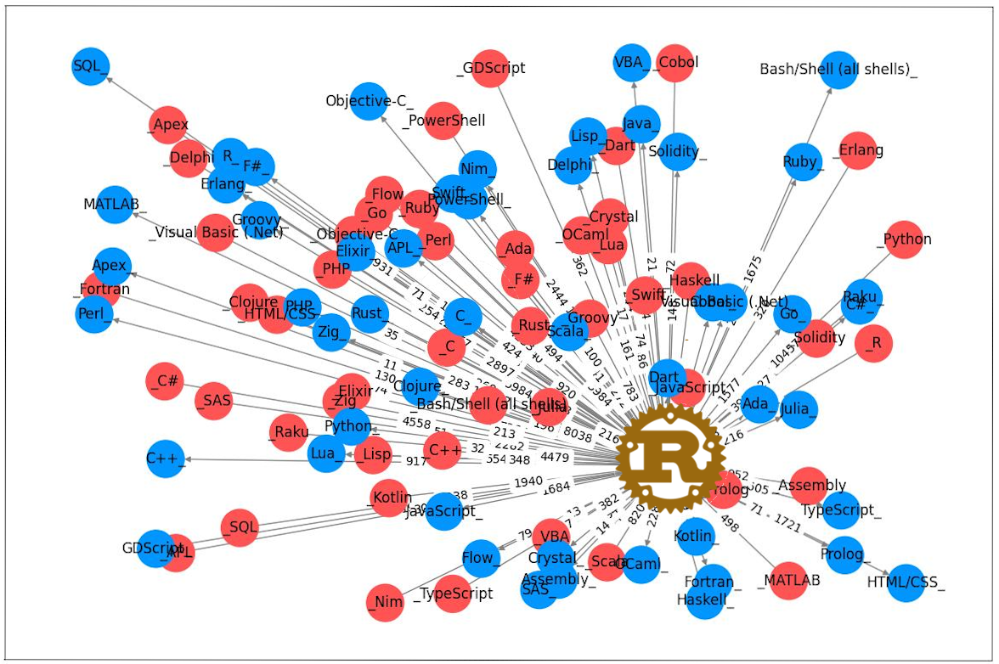

# Who Are The Rust Users?

<p align="center">
  
</p>

I was recently sharing my passion for building and programming systems with a colleague. During that exchange, he strongly recommended that I learn the **Rust** language in the near future  and get involved in its ecosystem.

I wanted to know more about this emerging language but I was under a heavy agenda and I did not have much time to research the web and sort through the many videos, tutorials, articles and blogs such as: : _[Rust in 100 Seconds](https://www.youtube.com/watch?v=5C_HPTJg5ek)_, _[What's so good about Rust?](https://developer.ibm.com/articles/os-developers-know-rust/)_, _[What is it used fort?](https://yalantis.com/blog/rust-market-overview/)_, _[Why should I learn it in 2023?](https://www.i2tutorials.com/five-reasons-why-you-should-learn-rust-in-2023/)_.

I was also enrolled in an inter-skills course in data engineering and data science, and this is what was keeping me so busy. However, by a happy coincidence, the first introduction project requested the students to create a Jupyter notebook to practise data wrangling and data modeling. The choice of  the dataset was free but the results had to be shared via a blog post.

Bingo, I had just found a way to kill two birds at once and decided to use the data from [Stackoverflow’s 2023 Annual Survey](https://survey.stackoverflow.co/2023/) to learn more about this language.

In summary, the four questions I decided to probe within the dataset are:
- *What are the job types of the Rust users?*
- *What are the best Rust paying jobs?*
- *What are the languages used in 2023 by the developers who plan to work with Rust in 2024?*
- *In what other languages do the Rust users plan to work in 2024?*


## Table of contents

- [How To](#how-to)
    - [Clone this repository](#clone-this-repository)
    - [Retrieve the dataset ](#retrieve-the-dataset)
    - [Create a virtual environemnt](#create-and-activate-a-virtual-environemnt))
    - [Install the Python packages](#install-the-required-python-packages)
- [Files and Directories](#files-and-directories)
- [Questions and Findings](#questions-and-findings)


## How To

### Clone this repository

``` bash
$ git clone git@github.com:fab7/LAB-Data-Science-Blog-Post.git
$ cd LAB-Data-Science-Blog-Post  
```

### Retrieve the dataset

```bash
$ mkdir dataset
$ cd dataset
$ curl -O https://cdn.stackoverflow.co/files/jo7n4k8s/production/49915bfd46d0902c3564fd9a06b509d08a20488c.zip/stack-overflow-developer-survey-2023.zip
$ unzip *2023.zip
$  cd -
```

### Create and activate a Virtual Environemnt
It is a recommended best practice to always create a Virtual Environemnt. This will make this project easily reproducible and will isolate it from your system installed Python and other Python environments.
```bash
$ python3 -m venv .venv
$ source .venv/bin/activate
```

### Install the required Python packages
#### Info/Warning: Make sure you are in your virtual envirnonment!

```bash
(.venv)$ pip install -r requirements.txt
```

## Files and Directories

### ./dataset

This directory will contain the dataset and the schema of the 2023 survey once you downloaded and decompressed it with the above `curl` and `unzip` commandands.
```
    ./dataset
        README_2023.txt
        so_survey_2023.pdf
        survey_results_public.csv
        survey_results_schema.csv
```
Note: Surveys from previous years can be found at: https://insights.stackoverflow.com/survey 

### ./notebook

Contains the the Python notebook. 
```
    ./notebook
        who_are_the_rust_users.ipynb
```


## Questions and Findings

### Q1

### Q2

### Q3


```
- LAB-Data-Science-Blog-Post

- A Jupyter notebook to practise data wrangling and data modeling for the purpose of writing a blog post

- Visual learners, it is claimed, learn best via pictures, videos and diagrams.

- However, if you like to gain a quick insight from pictures and diagrams (or short videos). 
```


