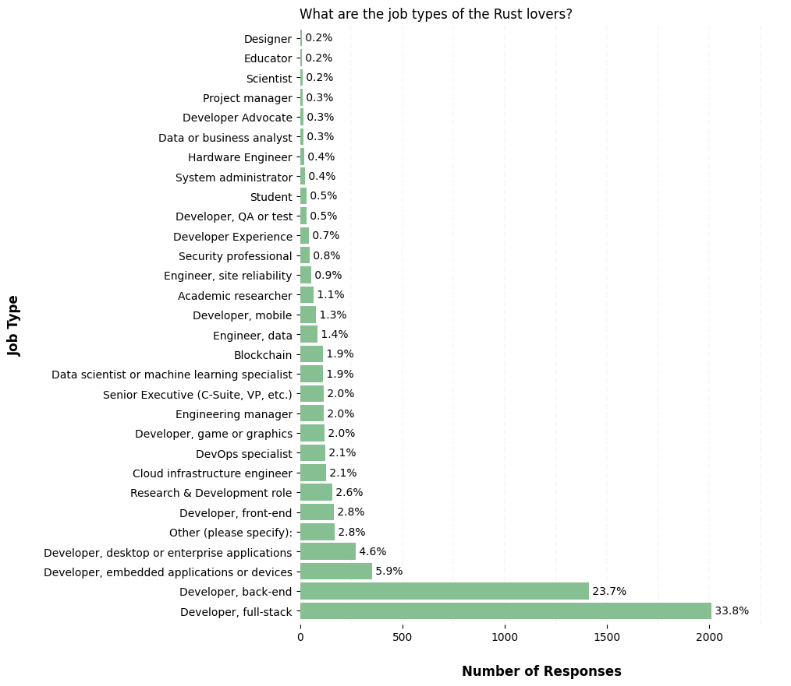
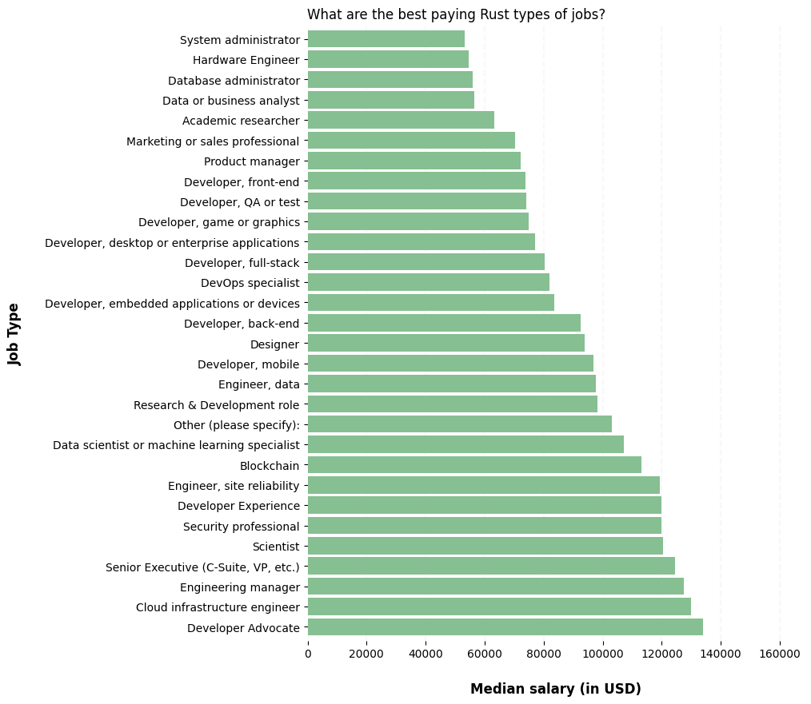
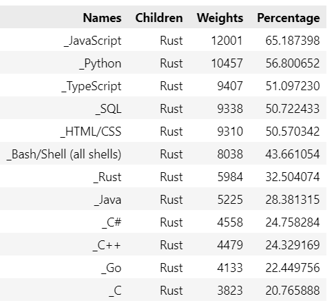
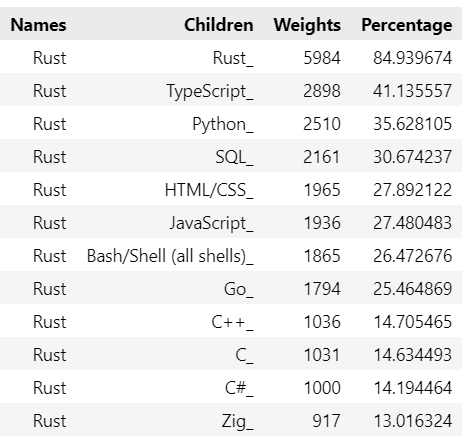

# Who Are The Rust Users in 2023?

<p align="center">
  
</p>

I was recently sharing my passion for building and programming systems with a colleague. During that exchange, he strongly recommended that I learn the **Rust** language in the near future  and get involved in its ecosystem.

I wanted to know more about this emerging language but I was under a heavy agenda and I did not have much time to research the web and sort through the many videos, tutorials, articles and blogs such as: : _[Rust in 100 Seconds](https://www.youtube.com/watch?v=5C_HPTJg5ek)_, _[What's so good about Rust?](https://developer.ibm.com/articles/os-developers-know-rust/)_, _[What is it used fort?](https://yalantis.com/blog/rust-market-overview/)_, _[Why should I learn it in 2023?](https://www.i2tutorials.com/five-reasons-why-you-should-learn-rust-in-2023/)_.

I was also enrolled in an inter-skills course in data engineering and data science, and this is what was keeping me so busy. However, by a happy coincidence, the first introduction project requested the students to create a Jupyter notebook to practise data wrangling and data modeling. The choice of  the dataset was free but the results had to be shared via a blog post.

Bingo, I had just found a way to kill two birds at once and decided to use the data from [*Stackoverflow’s 2023 Annual Survey*](https://survey.stackoverflow.co/2023/) to learn more about this language.

In summary, I decided to probe the following four questions within the dataset are:
- *What are the job types of the Rust users?*
- *What are the best Rust paying jobs?*
- *What are the languages used in 2023 by the developers who plan to work with Rust in 2024?*
- *In what other languages do the Rust users plan to work in 2024?*


## Table of contents

- [How To](#how-to)
    - [Clone this repository](#clone-this-repository)
    - [Retrieve the dataset ](#retrieve-the-dataset)
    - [Create a virtual environemnt](#create-and-activate-a-virtual-environemnt)
    - [Install the Python packages](#install-the-required-python-packages)
- [Files and Directories](#files-and-directories)
- [Questions and Findings](#questions-and-findings)


## How To

### Clone this repository

``` bash
$ git clone git@github.com:fab7/LAB-Data-Science-Blog-Post.git
$ cd LAB-Data-Science-Blog-Post  
```

### Retrieve the dataset

```bash
$ mkdir dataset
$ cd dataset
$ curl -O https://cdn.stackoverflow.co/files/jo7n4k8s/production/49915bfd46d0902c3564fd9a06b509d08a20488c.zip/stack-overflow-developer-survey-2023.zip
$ unzip *2023.zip
$  cd -
```

### Create and activate a Virtual Environemnt
It is a recommended best practice to always create a Virtual Environemnt. This will make this project easily reproducible and will isolate it from your system installed Python and other Python environments.
```bash
$ python3 -m venv .venv
$ source .venv/bin/activate
```

### Install the required Python packages
#### Info/Warning: Make sure you are in your virtual environment!

```bash
(.venv)$ pip install -r requirements.txt
```

### Start the Jupyter Notebook

```bash
(.venv)$ jupyter notebook
```

Open the `who_are_the_rust_users.ipynb` and step through the cells.


## Files and Directories

### ./dataset

This directory will contain the dataset and the schema of the 2023 survey once you downloaded and decompressed it with the above `curl` and `unzip` commandands.
```
    ./dataset
        README_2023.txt
        so_survey_2023.pdf
        survey_results_public.csv
        survey_results_schema.csv
```
Note: Surveys from previous years can be found at: https://insights.stackoverflow.com/survey 

### ./notebook

Contains the the Python notebook and helper module for plotting the pie and bar charts of the Blog Post. 
```
    ./notebook
        who_are_the_rust_users.ipynb
        blog_utils.py
```


## Questions and Findings

### Foreword
Because we were specifically interrested by the status of the professional community of Rust users, we restricted the statistical population of the study to **active professional developers** , thus excluding publics such as students, hobbyists, learners and retirees.

We further defined the following three groups of users:
- a Rust **user** is a respondent who has done extensive development work in Rust over the past year.
- a Rust **admirer** is a respondent who wants to work in Rust over the next year.
- a Rust **lover** is a Rust user who wants to continue working in Rust over the next year.  

### Q1 - What are the job types of the Rust lovers?
  
Rust is often referred to as a systems programming language which is particularly suitable to develop high performance operating-, embedded- and distributed- systems.

This seems to be confirmed by the distribution of the job types among the Rust lovers. The full-stack and back-end types of jobs stand out with more than 57.5% of the Rust lovers doing extensive work in those areas. Embedded shows up in third position (5.9%) ahead of front-end (2.8%) and before areas such as research, cloud infrastucture and gaming.

<p align="center">
  
</p>

### Q2 - What are the best Rust paying jobs?

The median salary of the Rust lovers is **$88.015** and the best paying jobs are the areas of  technical evangelists, cloud infrastructure engineers as well as the usual managerial positions. 

<p align="center">
  
</p>

### Q3 - What languages do Rust admirers develop in 2023?

The first third (**29.1%**) of the **admirers** who want to work in Rust over the next year, are using high-level scripting languages such as *JavaScript*. *Python* and *TypeScript*. Then come the application and admin oriented languages such as *SQL*, *HTML/CSS* and *Bash* (**24.3%**) before another series of high-level compiled languages such as *Java*, *C#*, *C++* and *Go*.

<p align="center">
  
</p>

<p align="center">
  
</p>

### Q4 - What languages dao Rust users want to develop in 2024?

One of the results of the *Stack Overflow* survey already showed that Rust was the most loved language with more than 80% of developers that used it in 2023 also want to use it again in 2024. 

This is confirmed by our findings with **85%** of the active professionnal developers answering in the same way. Interestingly, aside from *JavaScript* which drops sharply in the ranking,  the distribution of the languages that the Rust users want to work in 2024 is similar to the distribution of the Rust admirers who plan to start working in Rust in 2024.       

<p align="center">
  
</p>

<p align="center">
  
</p>


