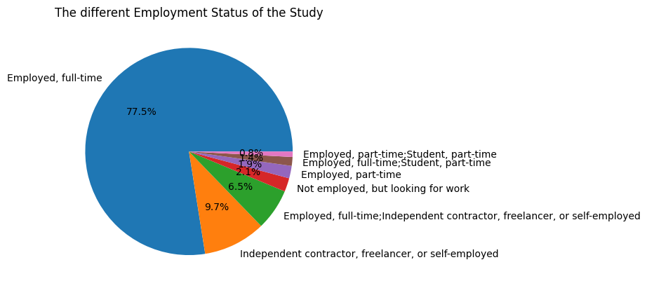
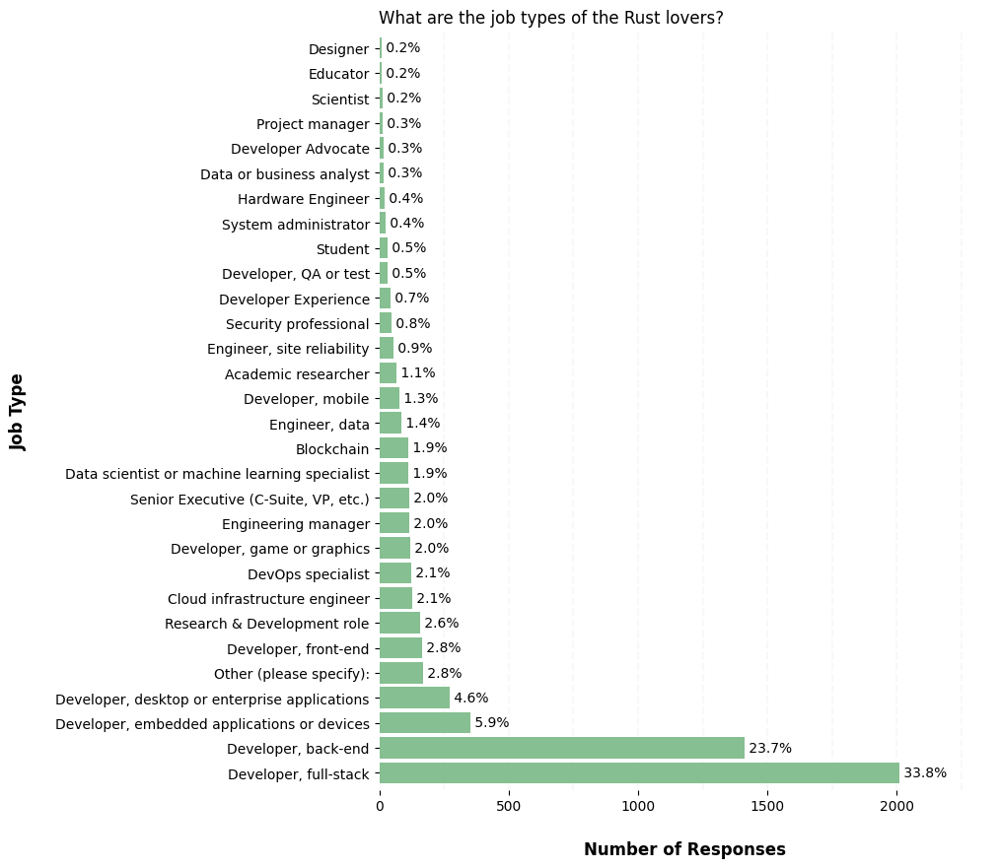
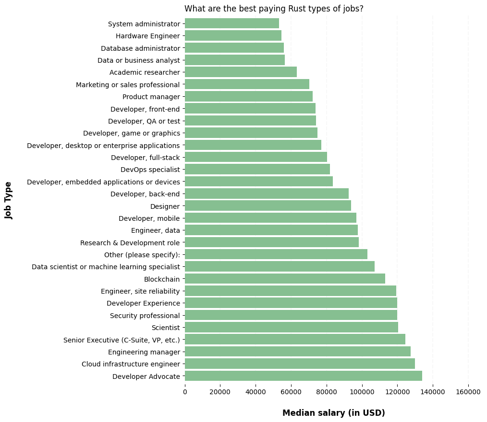
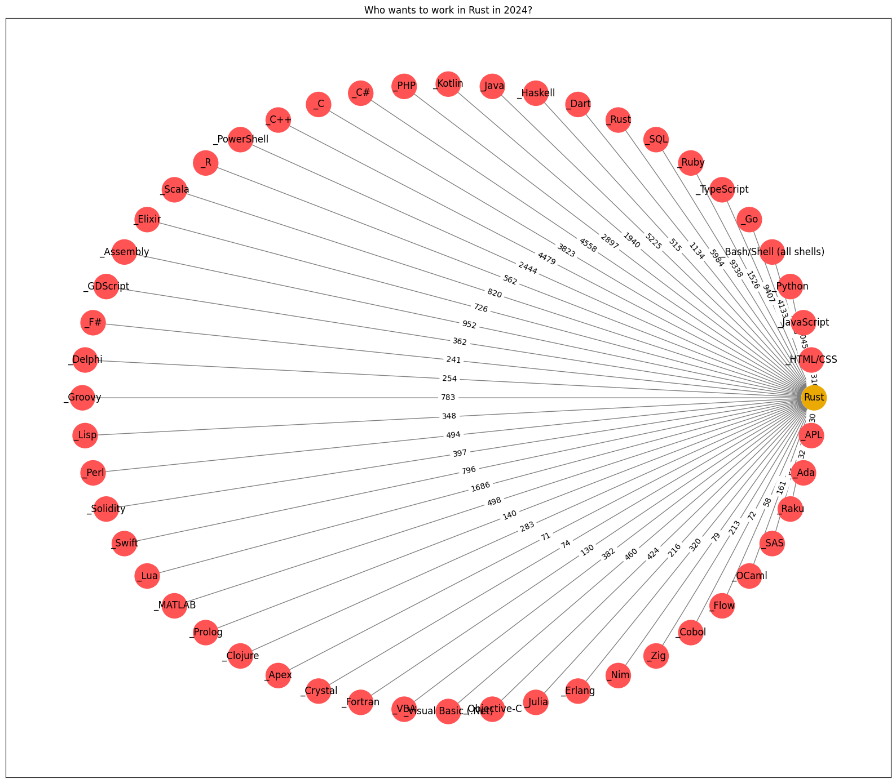
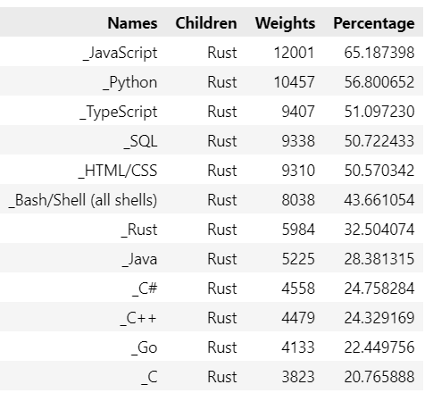
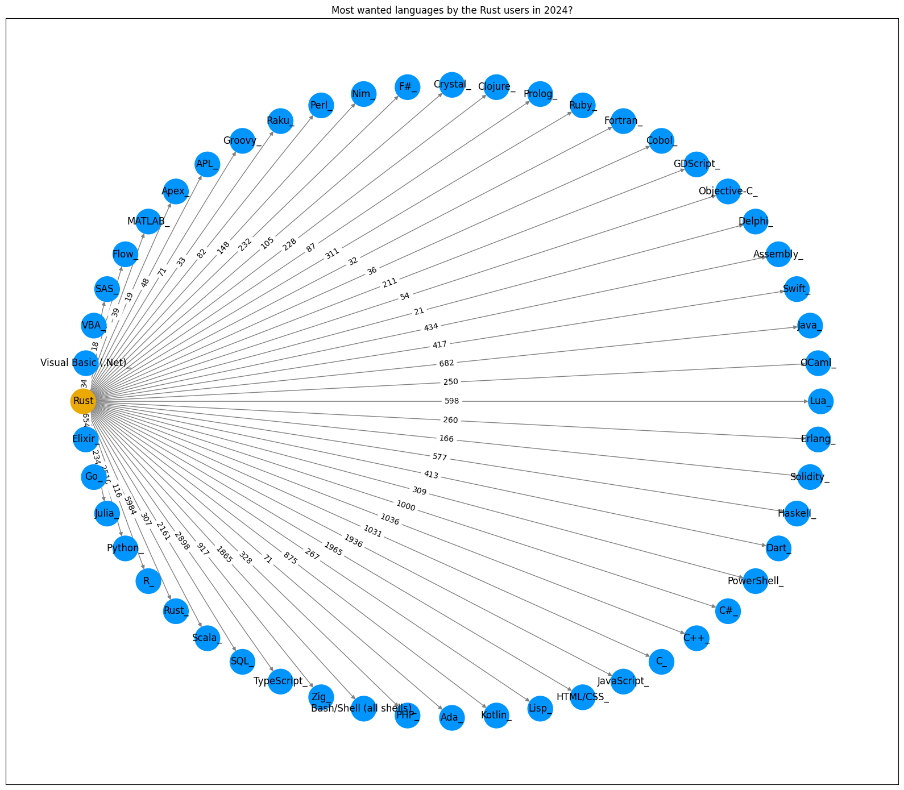
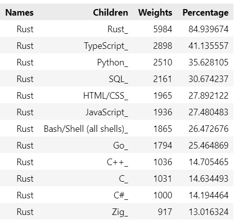

# Who Are The Rust Users in 2023?

I was recently sharing my passion for building and programming systems with a colleague. During that exchange, he strongly recommended that I learn the **Rust** language in the near future  and get involved in its ecosystem.

Because I was under a heavy agenda, I did not have time to research the web and sort through the many videos, tutorials, articles and blogs such as: _[Rust in 100 Seconds](https://www.youtube.com/watch?v=5C_HPTJg5ek)_, _[What's so good about Rust?](https://developer.ibm.com/articles/os-developers-know-rust/)_, _[What is it used for?](https://yalantis.com/blog/rust-market-overview/)_, _[Why should I learn it in 2023?](https://www.i2tutorials.com/five-reasons-why-you-should-learn-rust-in-2023/)_.

At least, I wanted to understand who the Rust users were and what kind of development they were doing. The idea was to draw a parallel with my profile before delving deeper. 

With that goal in mind, I used the *2023 Stack Overflow Annual Survey* dataset to try to elicit this insight by asking the following four questions:
- *What are the job types of the Rust users?*
- *What are the best Rust paying jobs?*
- *What are the languages used in 2023 by the developers who plan to work with Rust in 2024?*
- *In what other languages do the Rust users plan to work in 2024?*

## What the Stack Overflow survey results already tells us about Rust

The Stack Overflow survey is conducted every year among tens of thousands of developers who share how they learn new and level up, 
which tools they’re using, how much they earn and how they are looking ahead to the future.

The last survey was conducted in May 2023 among 90,000 developers and it provides a wealth of information about the software developer community, the tools and the 
programming environments in use today.

With respect to the Rust language, you will learn that:
- [**13.05%**](https://survey.stackoverflow.co/2023/#section-most-popular-technologies-programming-scripting-and-markup-languages) of all respondents have done  extensive development work in Rust over the past year.
- Rust is the most admired language with more than [**80%**](https://survey.stackoverflow.co/2023/#section-admired-and-desired-programming-scripting-and-markup-languages) of developers saying that they want to use it again next year.
- the relatively good [**pay rating**](https://survey.stackoverflow.co/2023/#section-top-paying-technologies-top-paying-technologies) of Rust among other languages.
- and a nice [**mapping**](https://survey.stackoverflow.co/2023/#section-worked-with-vs-want-to-work-with-programming-scripting-and-markup-languages) of the languages that users are interested in versus the ones they are already using. 

## Refining the statistical population of Rust users

In this study, we were specifically interested by the status of the professional community of Rust users. We therefore restricted the statistical population to **active professional developers**, thus excluding publics such as full-time students, hobbyists, learners and retirees. This led to the following population being considered:

  

 
We further defined the following three groups of users to focus on:
- a Rust **user** is a respondent who has done extensive development work in Rust over the past year.
- a Rust **admirer** is a respondent who wants to work in Rust over the next year.
- a Rust **lover** is a Rust user who wants to continue working in Rust over the next year.

In summary, our investigation will cover a population of **7,045 Rust users**  and **18,410 Rust admirers** who respectively represent **7.9%** and **20.6%** of the  respondents to the initial survey. 

Finaly, they are **5,984 Rust lovers**  among the Rust users, and they represents **84.9%** of the Rust users.

## Q1 - What are the job types of the Rust users?

As a first step, it may be interesting to compare your own profile with that of common Rust developers in the industry.

If you are for example heavily involved in hardware development, the opportunities of leveraging Rust might be less important than in the server back-end development.

 
    

As you can read from the bar chart, the language is going to offer you much more opportunities in the fields of full-stack and back-end types of developments, which stand out with more than **57.5%** of the Rust lovers already doing extensive work in those areas. Rust is also particularly suitable for embedded systems which naturally shows up in third position (**5.9%**), ahead of front-end (**2.8%**) and before research, cloud infrastructure and gaming.

### Q2 - What are the best Rust paying jobs?

Second, you might want to consider the salary  early in your investigation process as the more crowded the field, the lower the salary usually is.

  

The median salary of the Rust lovers is **$88,000** and the best paying jobs are in the areas of  technical evangelists, cloud infrastructure engineers as well as the usual managerial positions. 

### Q3 - What languages do Rust admirers develop in 2023?

With the first question, we were suggesting to try and position your profile against the distribution of job types that are already using Rust in production.

However, another good indicator could be to compare the languages that your like against the languages mastered by other Rust admirers out there. You might well be riding the same wave.      

  

I did not expect the network above to be so crowded. I nevertheless decided to keep it as is to graphically represent the attraction this language has among developers currently working in over 30 different languages.

The first third (**29.1%**) of all admirer responses indicate that they are using high-level scripting languages such as *JavaScript*. *Python* and *TypeScript*. Then come the application and admin oriented languages such as *SQL*, *HTML/CSS* and *Bash* (**24.3%** of the responses) before another series of high-level compiled languages such as *Java*, *C#*, *C++* and *Go*.

  

### Q4 -  What languages do the Rust users want to code in 2024?

According to *Stack Overflow*, Rust is on its eight year as the most loved language with more than 80% of developers saying they want to continue using it. With such popularity, one may wonder if there exists a life after Rust, and if so, which one?

  

Surprisingly, the network showing what next languages the Rust lovers want to work with, is also extremely  dense. This may indicate that the formulation of the question was maybe too broad and that many respondents miss-interpreted it.

Interestingly, aside from *JavaScript* which drops sharply in the ranking,  the distribution of the languages that the Rust users want to work in 2024 is similar to the distribution of the Rust admirers who plan to start working in Rust in 2024.       

Otherwise, the popularity of Rust is definitively confirmed by our findings with **85%** of the active professional developers answering in the same way.

  

## Key Takeaways

In this article, we took a closer look at the Stack Overflow 2023 survey data and we specifically polled responses from the respondents who are users of the Rust language, as well as the ones who plan to work in it in 2024. The intent was to give the reader a few more arguments why he should or should not learn Rust in 2023. 

The data suggest that:

  - More than **50%** of the Rust users evolve in full-stack and back-end development types of jobs.
    
  - In 2023, the median salary of a Rust user is **$88.000**. 
    
  - There is a strong trend among users of interpreted languages who want to upgrade to Rust. This is probably due to its memory safety enforcement and its high performance guarantees.

  - Developers who have engaged with Rust are  85% satisfied and don't plan to change language in 2024. This seems to explain why Rust has been at the top of the most loved languages for almost 8 years.   

